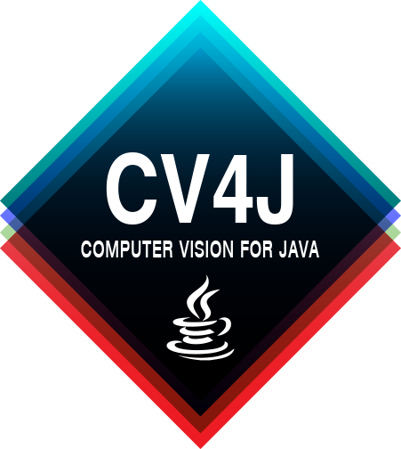
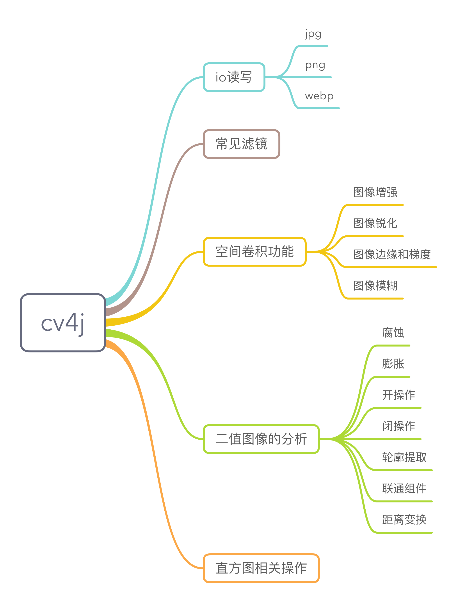

# cv4j

[](https://www.apache.org/licenses/LICENSE-2.0.html)
[](https://travis-ci.org/imageprocessor/cv4j)
[](https://circleci.com/gh/imageprocessor/cv4j)
[](https://www.codacy.com/app/fengzhizi715/cv4j?utm_source=github.com&amp;utm_medium=referral&amp;utm_content=imageprocessor/cv4j&amp;utm_campaign=Badge_Grade)

The target is to set up a high quality and real-time image process and machine learning library which is implemented in pure java. The framework can run application on java desktop and android platform.



# 最新版本

模块|cv4j|rxcv4j
---|:-------------:|:-------------:
最新版本|[  ](https://bintray.com/fengzhizi715/maven/cv4j/_latestVersion)|[  ](https://bintray.com/fengzhizi715/maven/rxcv4j/_latestVersion)


# 下载和使用
## 1.单独下载cv4j

```groovy
compile 'com.cv4j:cv4j:0.1.2'
```

## 2.下载rxcv4j

rxcv4j 是使用 RxJava2.x 进行的封装，如果下载该模块的话无需再下载cv4j。

```groovy
compile 'com.cv4j:rxcv4j:0.1.1.1'
```


目前已经实现的功能：


# 常见滤镜

| 滤镜名称        | 作用          | 备注          |
| ------------- |:-------------:| :-------------:|
|BoxBlurFilter|盒子模糊，支持水平与垂直经向模糊，模糊半径通常为奇数1、3、5、7、9、11、15|快速模糊算法|
|CarveFilter|浮雕效果, 支持两种浮雕类型，根据boolean参数决定使用哪一种|像素差值计算
|ColorFilter|颜色匹配，支持12种颜色风格转换(相当于12个滤镜)， 基于查找表实现，速度极快|LUT加速计算|
|ConBriFilter|调整图像对比度与亮度，默认是提升对比，降低亮度，默认值分别为1.2， 0.7|对比度与亮度调整|
|EmbossFilter|轧花效果，基于跟浮雕效果类似，但是更加灵活，可以执行更多像素值校正|轧花效果|
|ExposureFilter|曝光效果，基于图像像素值取反，有一种类似光学相机曝光照片的效果|光爆效果
|FastEPFilter|边缘保留滤波-基于积分图的边缘保留滤波，是一种很好的噪声抑制算法，常用来实现人脸美化的关键步骤|边缘保留|
|FloSteDitheringFilter|抖动效果-基于错误扩展的抖动算法，实现像素点离散填充与二值化显示|抖动效果|
|GammaFilter|伽马校正，基于光学相机拍照之后，经常需要做此操作|伽马校正|
|GaussianBlurFilter|高斯模糊，基于高斯公式的图像模糊，比盒子模糊有更好的效果，但是速度较慢|高斯模糊|
|GaussianNoiseFilter|高斯噪声-产生高斯随机噪声，在图像中使用高斯随机噪声|高斯噪声|
|GlowFilter|光线效果，在图像中模仿自然光线照射|光线效果|
|GradientFilter|梯度效果，基于图像一阶导数算子实现的梯度效果，很好的显示了图像主要轮廓与边界|梯度效果|
|MeansBinaryFilter|黑白效果， 基于图像均值实现图像二值化效果|黑白效果|
|MosaicFilter|马赛克效果，基于积分图实现的图像马赛克效果，速度快效果好，支持矩形马赛克|马赛克效果|
|MotionFilter|移动效果，基于模糊与几何形变实现的图像模糊移动效果|移动效果|
|NatureFilter|自然系滤镜,根据参数选择，总计有八种自然风格的颜色滤镜(相当于8个滤镜)|自然系效果|
|OilPaintFilter|油画效果，基于轮廓与颜色分布实现的油画效果，逼真模拟秋日风情|油画效果|
|SepiaToneFilter|怀旧风格， 经典的图像怀旧风格滤镜，一秒生成|怀旧风格|
|SinCityFilter|邪恶之城，基于像素值局部变化的滤镜，可以根据输入参数调整阈值范围与对比颜色值|邪恶之城|
|SpotlightFilter|探照灯效果，基于中心像素距离而调整图像亮度的，产生亮度扩展效果|探照灯滤镜|
|StrokeAreaFilter|铅笔画效果， 模仿铅笔模糊实现， 可以将输入图像变了写生铅笔画，细节多少根据参数决定|铅笔画效果|
|VignetteFilter|边框效果，给图像加上立体边框，默认边框为黑色，可以通过输入参数调整边框大小与边框颜色|立体边框|
|WaterFilter|水波纹效果-模拟水波纹扩展效果，在输入图像中|
|WhiteImageFilter|增白亮度-通过参数可以调整图像亮度，有照片增白效果|增白效果|

# 空间卷积滤镜

| filter       | 名称        | 作用        |
|:-------------|:-------------| :-------------|
|ConvolutionHVFilter |卷积|模糊或者降噪|
|MinMaxFilter|最大最小值滤波|去噪声|
|SAPNoiseFilter |椒盐噪声|增加噪声|
|SharpFilter |锐化|增强|
|MedimaFilter |中值滤波|去噪声|
|LaplasFilter |拉普拉斯|提取边缘|
|FindEdgeFilter |寻找边缘|梯度提取|
|SobelFilter |梯度|获取x、y方向的梯度提取|
|VarianceFilter |方差滤波|高通滤波|
|MaerOperatorFilter |马尔操作|高通滤波|
|USMFilter |USM|增强|

# 联系方式
cv4j QQ交流群：492962708

cv4j slack协同管理：[Join the Slack team for cv4j](https://cv4j.slack.com/join/shared_invite/MTg5MDE1NDk2NDA1LTE0OTU4NzM2MjAtMjI3YTg0YzkyMA)

cv4j的系列文章：http://www.jianshu.com/nb/10401400

# ChangeLog
[版本更新记录](CHANGELOG.md)

# Contributing
[Pull requests](https://help.github.com/categories/collaborating-with-issues-and-pull-requests/) are welcome; see the [contributor guidelines](CONTRIBUTING.md) for details.